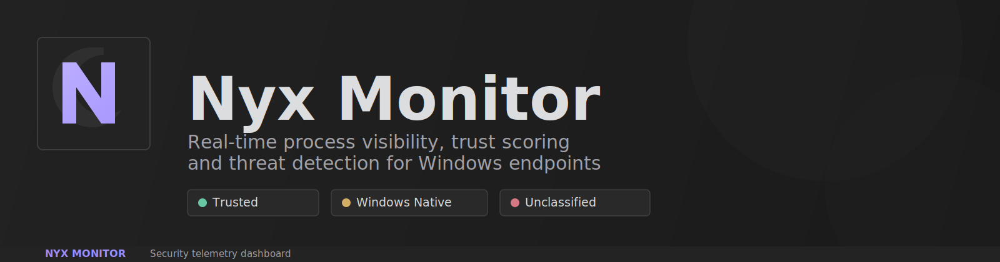
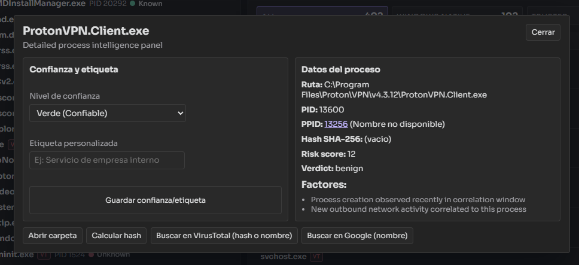

# Nyx Monitor



Nyx Monitor es una aplicacion de escritorio para Windows orientada a observabilidad de procesos, clasificacion de confianza y deteccion de actividad sospechosa en tiempo real.

## Instalacion para usuarios (rapida)

1. Ir a `Releases` del repositorio.
2. Descargar el instalador `Nyx Monitor ...-setup.exe`.
3. Ejecutar el `.exe` y completar el asistente.

No necesitas Rust, Node ni Visual Studio para instalar la app desde release.

## Estado actual

- Nombre del producto: `Nyx Monitor`
- Runtime de escritorio: `Tauri 2`
- Frontend: `React + TypeScript + Vite`
- Backend: `Rust`
- Plataforma objetivo principal: `Windows 10/11`

## Funcionalidades principales

- `Overview`: resumen de carga, alertas activas y grafica de CPU por proceso.
- `Processes`: arbol de procesos + tabla de procesos en ejecucion con CPU, GPU, memoria, PID y PPID.
- `Threats`: procesos bajo revision ordenados por riesgo.
- `Timeline`: eventos de proceso, red, registro y respuesta.
- `Health`: salud de sensores y metricas de rendimiento del loop.
- `Response`: politica de respuesta manual/automatica.
- `Alerts`: incidentes activos con borrado individual y masivo.
- `Installed`: inventario de programas instalados por nivel de confianza.
- `Startup`: procesos y entradas de arranque.
- `History`: historial de uso de aplicaciones.

## Capturas

### Process Lineage


### Popup de proceso



## Modelo de confianza y riesgo (resumen)

- Clasificacion de confianza de proceso/programa:
  - `windows_native`
  - `trusted`
  - `unknown`
- Overrides manuales persistentes por proceso/programa (nivel + etiqueta personalizada).
- Deteccion por heuristicas de proceso + correlacion de senales.
- Veredicto final endurecido para reducir falsos positivos:
  - no depende solo del score bruto
  - considera nivel base, confianza, correlacion e internos
- Procesos internos de Nyx (`nyx-monitor`, `p-control`) se tratan como confiables.

## Requisitos

- `Node.js` 20+
- `Rust stable` (`rustup`, `cargo`)
- `Visual Studio Build Tools 2022` (MSVC + Windows SDK)
- `WebView2 Runtime`
- `PowerShell` habilitado (el script wrapper configura entorno de compilacion)

## Ejecucion local

```powershell
npm install
npm run tauri dev
```

## Build de aplicacion

```powershell
npm run tauri build
```

Artefactos de salida esperados:

- `src-tauri/target/release/bundle/msi/`
- `src-tauri/target/release/bundle/nsis/`

## Release automatico (GitHub Actions)

El repositorio incluye workflow para generar y publicar automaticamente el instalador `.exe` de Windows al crear un tag:

```powershell
git tag v0.1.1
git push origin v0.1.1
```

Workflow: [.github/workflows/release-windows.yml](.github/workflows/release-windows.yml)

Salida publicada en GitHub Release:

- `src-tauri/target/release/bundle/nsis/*.exe`

## Scripts NPM

- `npm run dev`: frontend Vite en `:1420`
- `npm run build`: build frontend
- `npm run preview`: preview frontend build
- `npm run tauri dev`: app escritorio en desarrollo
- `npm run tauri build`: build de bundles instalables

## Estructura del proyecto

- `src/`: UI (tabs, componentes, hooks, estilos, api client Tauri)
- `src-tauri/src/`: backend (monitorizacion, deteccion, estado, persistencia, comandos)
- `src-tauri/icons/`: iconos app/bundles
- `scripts/tauri-wrapper.ps1`: wrapper de entorno para ejecutar Tauri en Windows

## Persistencia local

Nyx Monitor guarda datos en `app_data_dir` de Tauri (Windows), incluyendo:

- `alerts.json`
- `known_entities.json`
- `events.db`
- `response_actions.json`

## Troubleshooting rapido

### Error: `cargo metadata ... program not found`

Causa: `cargo` no esta instalado o no esta en `PATH`.

Solucion:

1. Instalar Rust (`rustup`).
2. Abrir una nueva terminal.
3. Verificar:

```powershell
cargo --version
rustc --version
```

### Error de linker (`link.exe` / `kernel32.lib`)

Causa: faltan Build Tools o entorno MSVC/SDK incompleto.

Solucion:

1. Instalar Visual Studio Build Tools con C++ y Windows SDK.
2. Ejecutar comandos Tauri usando el wrapper:

```powershell
npm run tauri dev
```

## Nota de alcance

- Proyecto centrado en Windows.
- El motor de deteccion es heuristico (no sustituye un EDR/AV profesional).
